#  Premade Graph

<br />

[English](README.md) | [Magyar](README.hu.md)


**Premade Graph** is a League of Legends thesis project that collects match-history data, builds repeated player co-presence graphs, and analyzes the resulting networks through a Node/Express API, a Rust graph-analytics runtime, and a React/Vite frontend.

The current thesis scope is intentionally narrower and more defensible:

- expand and document the `flexset` and `soloq` datasets
- interpret `flexset` as an associative core-periphery player graph
- compare Flex Queue and SoloQ without overstating social meaning
- measure `opscore` and `feedscore` assortativity on graph edges
- compute weighted Brandes betweenness centrality in Rust with Rayon
- keep Genetic NeuroSim v2 as future work seeded from validated graph/player profiles

Signed Balance / Structural Balance still exists in code as a diagnostic, but it is retired from the thesis-facing product narrative. See [Signed Balance Methodological Retirement](docs/signed-balance-methodological-retirement.md).

## Current UI

The frontend has moved from a simple graph viewer into a research cockpit: dataset controls, pathfinding playback, Graph V2 exports, evidence documentation, and Rust-backed analytics pages all sit in one interface.

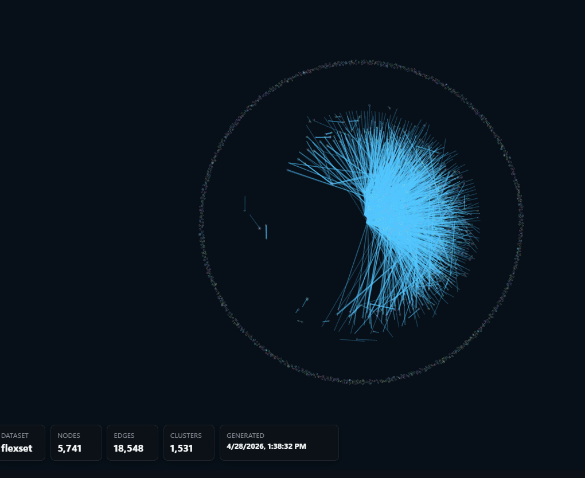

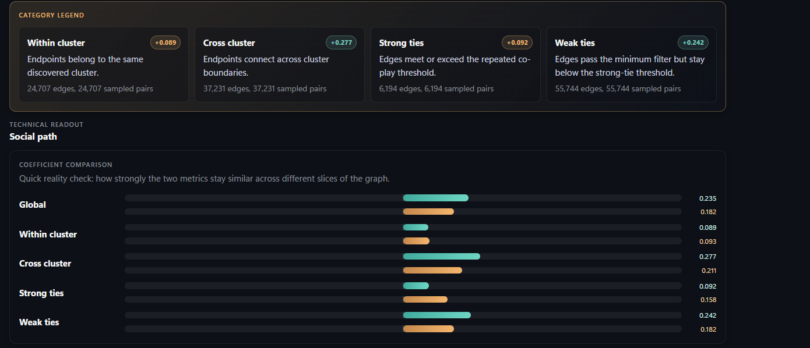

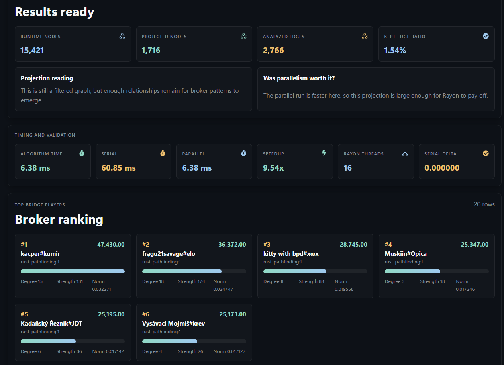


## What The System Does

| Area | Current role |
| --- | --- |
| Dataset collection | Riot API match collection with dataset-specific presets for Apex Flex Queue and Master SoloQ |
| Player scoring | role-aware `opscore` / `feedscore` style metrics used as node attributes |
| Graph construction | repeated co-presence projection into ally/enemy relationship evidence and Graph V2 artifacts |
| Assortativity | numeric Pearson-style edge correlation for `opscore` and `feedscore` |
| Brandes centrality | weighted node betweenness centrality using `1 / strength` edge costs, with serial/parallel modes |
| Pathfinder Lab | BFS, Dijkstra, Bidirectional search, exact A*, replay, and algorithm comparison |
| Documentation panel | synced Obsidian-style docs, thesis PDF preview, and chapter evidence/provenance notes |

## Evidence Trail

The repository now includes an explicit proof map for thesis defense:

- [Chapter Evidence Map](docs/chapter-evidence-map.md) links every thesis chapter to its supporting markdown notes, code paths, diagrams, datasets, and bibliography keys.
- [Document Map](docs/DOCUMENT_MAP.md) is the agent-readable index for the documentation vault.
- `docs/evidence/` contains one evidence note per thesis chapter.
- The frontend Documentation page surfaces the chapter evidence notes as first-class material.

The point is simple: claims in the thesis should point back to concrete sources and implementation artifacts.

## Architecture Snapshot

```text
frontend/ React + Vite UI
    |
    | HTTP JSON
    v
backend/server.js Express API shell
    |
    | SQLite, collector orchestration, Rust process bridge
    v
backend/pathfinder-rust Rust runtime
    |
    | GraphState, search, Graph V2, assortativity, centrality
    v
datasets / SQLite / generated graph artifacts
```

| Layer | Responsibility |
| --- | --- |
| Python scripts | match collection, legacy graph-building, enrichment helpers |
| SQLite | player metadata, scores, clusters, replay persistence, dataset-local databases |
| Node/Express | API shell, dataset registry, runtime keys, collector lifecycle, Rust bridge |
| Rust | canonical runtime graph projection, pathfinding, Graph V2 exports, analytics |
| React/Vite | dataset controls, graph exploration, analytics pages, pathfinder playback, documentation reader |

## Quick Start

### Local development

From the repository root:

```bash
npm install
npm run dev
```

This starts:

- frontend: `http://localhost:5173`
- backend: `http://localhost:3001`

### Docker

```bash
docker compose up --build
```

Docker runs the backend, frontend, and database explorer service. The frontend uses the bundled documentation manifest when repo-root `docs/` is not mounted into the frontend container.

## Main Workflows

### 1. Collect Match Data

Collector presets live in [backend/collector_configs](backend/collector_configs):

- [apex-flex-collector.json](backend/collector_configs/apex-flex-collector.json)
- [master-soloq-eune-collector.json](backend/collector_configs/master-soloq-eune-collector.json)

Run from `backend/`:

```bash
python match_collector.py
```

### 2. Normalize Players

```bash
cd backend
node add_new_players.js
node normalize_players_by_puuid.js
```

### 3. Run Rust Analytics

From `backend/pathfinder-rust/`:

```bash
cargo run -- options
```

Assortativity:

```bash
echo '{"minEdgeSupport":1,"includeClusterBreakdown":true}' | cargo run -- assortativity
```

Betweenness centrality:

```bash
echo '{"pathMode":"battle-path","weightedMode":true,"parallel":true,"runSerialBaseline":true}' | cargo run -- betweenness-centrality
```

Pathfinding:

```bash
echo '{"sourcePlayerId":"...","targetPlayerId":"...","algorithm":"astar","pathMode":"social-path","weightedMode":true,"options":{"includeTrace":false,"maxSteps":5000}}' | cargo run -- run
```

Backend routes:

```text
POST /api/pathfinder-rust/assortativity
POST /api/pathfinder-rust/assortativity-significance
POST /api/pathfinder-rust/betweenness-centrality
POST /api/pathfinder-rust/run
POST /api/pathfinder-rust/compare
```

Signed-balance routes still exist for diagnostic reruns, but they should not be presented as a main empirical result unless the scope is explicitly reopened.

## Repository Map

### Root

- [AGENTS.md](AGENTS.md): active scope and future-work rules
- [CLAUDE.md](CLAUDE.md): structural map for Claude/Codex sessions
- [README.hu.md](README.hu.md): Hungarian README
- [docker-compose.yml](docker-compose.yml): backend/frontend/database explorer services
- [playersrefined.db](playersrefined.db): root refined player database
- [docs/](docs): thesis notes, evidence notes, diagrams, and PDF sources

### Backend

- [backend/server.js](backend/server.js): Express API, dataset registry, collector/runtime orchestration
- [backend/match_collector.py](backend/match_collector.py): Riot API collector
- [backend/scoring_config.js](backend/scoring_config.js): scoring configuration
- [backend/cluster_persistence.py](backend/cluster_persistence.py): cluster persistence helper
- [backend/pathfinder/rustBridge.js](backend/pathfinder/rustBridge.js): Node-to-Rust process bridge
- [backend/pathfinder-rust](backend/pathfinder-rust): Rust graph runtime and analytics crate

### Rust Runtime

- [engine/graph.rs](backend/pathfinder-rust/src/engine/graph.rs): `GraphState` construction and relationship projection
- [engine/search.rs](backend/pathfinder-rust/src/engine/search.rs): BFS, Dijkstra, Bidirectional search, exact A*
- [engine/assortativity.rs](backend/pathfinder-rust/src/engine/assortativity.rs): numeric graph assortativity
- [engine/centrality.rs](backend/pathfinder-rust/src/engine/centrality.rs): weighted Brandes betweenness centrality
- [engine/graph_v2.rs](backend/pathfinder-rust/src/engine/graph_v2.rs): Graph V2 exports
- [engine/birdseye.rs](backend/pathfinder-rust/src/engine/birdseye.rs): 3D graph artifact exports
- [engine/signed_balance.rs](backend/pathfinder-rust/src/engine/signed_balance.rs): retired signed-balance diagnostic

### Frontend

- [frontend/src/App.tsx](frontend/src/App.tsx): route tree and shell
- [frontend/src/GraphSpherePage.tsx](frontend/src/GraphSpherePage.tsx): 3D global graph sphere
- [frontend/src/PathfinderLabPage.tsx](frontend/src/PathfinderLabPage.tsx): pathfinding lab and replay surface
- [frontend/src/AssortativityPage.tsx](frontend/src/AssortativityPage.tsx): performance-metric assortativity UI
- [frontend/src/BetweennessCentralityPage.tsx](frontend/src/BetweennessCentralityPage.tsx): Brandes centrality UI
- [frontend/src/DocumentationPage.tsx](frontend/src/DocumentationPage.tsx): synced markdown/PDF evidence reader

## Screenshots

### Dataset Graphs

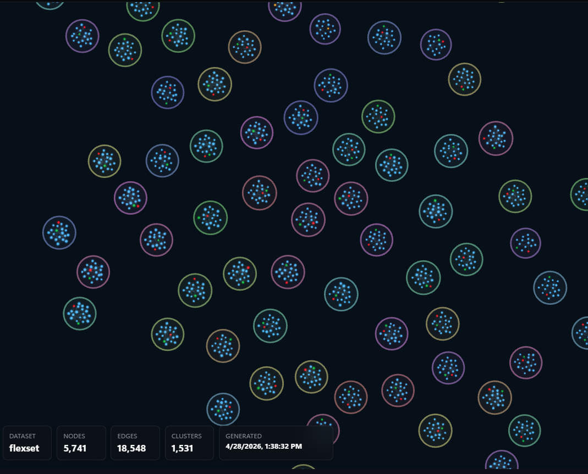

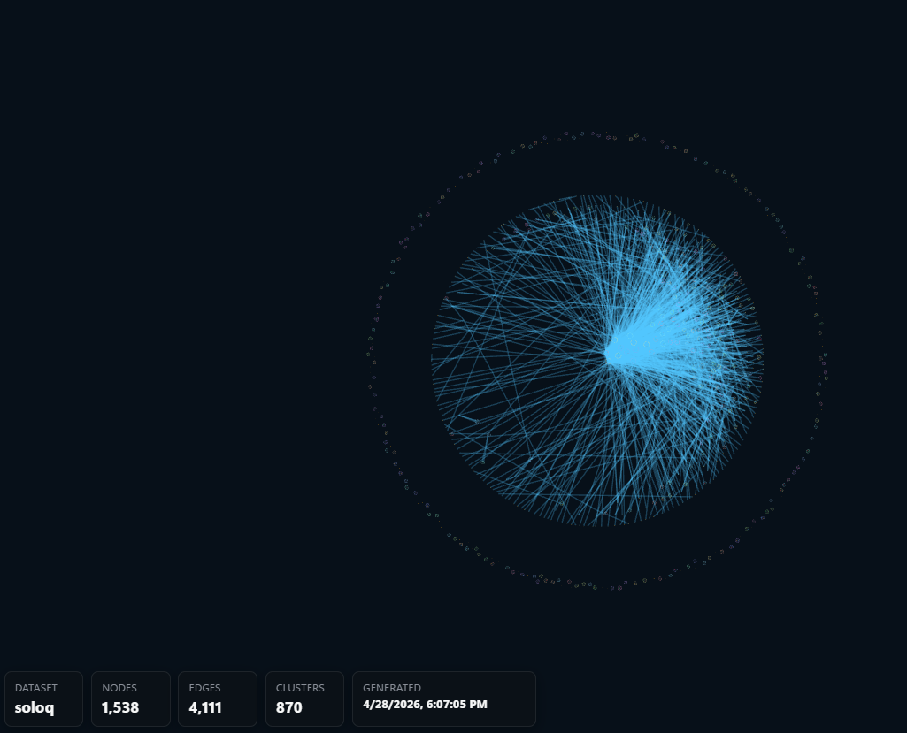

### Assortativity

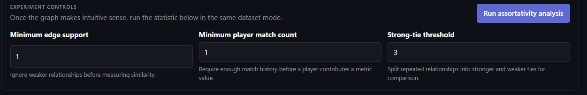

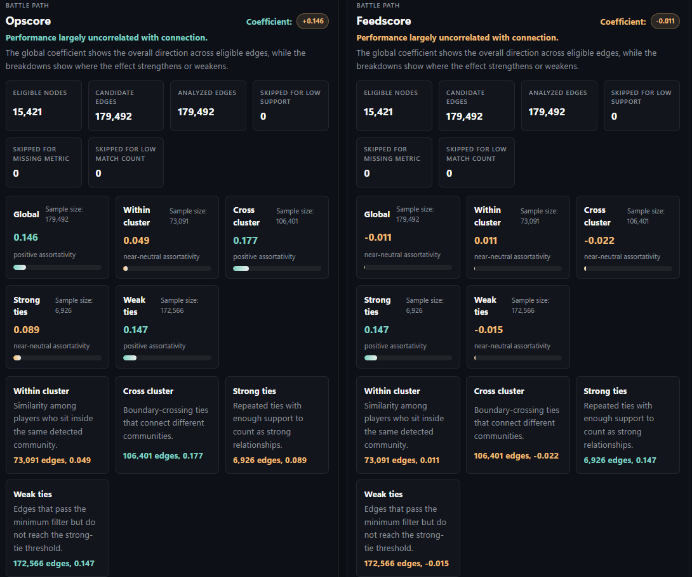

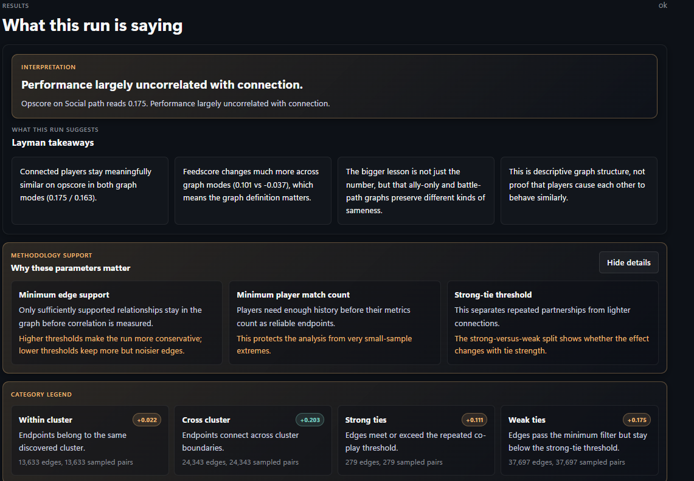

### Betweenness Centrality

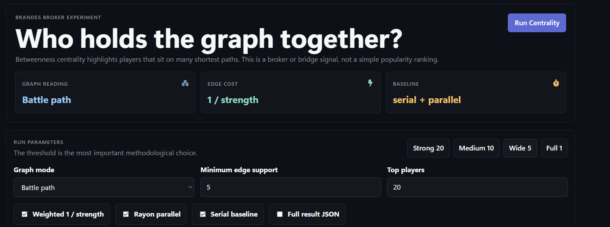

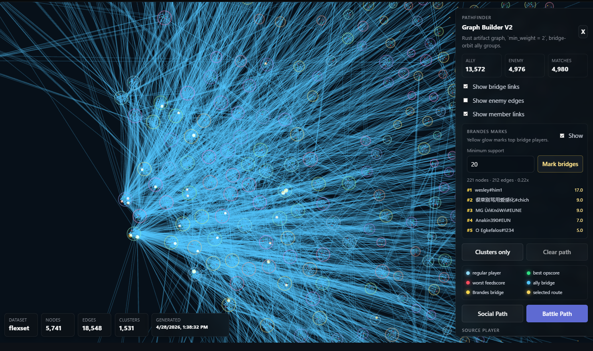

### Pathfinder

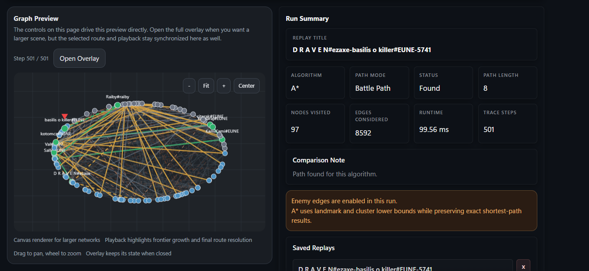

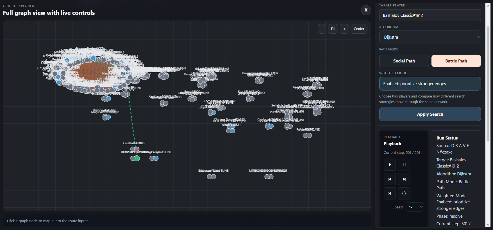

## Documentation

Recommended starting points:

- [Chapter Evidence Map](docs/chapter-evidence-map.md)
- [Document Map](docs/DOCUMENT_MAP.md)
- [Project Feasibility Review And Additions](docs/project-feasibility-review-and-additions.md)
- [Flexset Associative Graph Interpretation](docs/flexset-associative-graph-interpretation.md)
- [SoloQ Associative Graph Interpretation](docs/soloq-associative-graph-interpretation.md)
- [Assortativity Analysis](docs/assortativity-analysis.md)
- [Parallel Brandes Implementation Plan](docs/parallel-brandes-implementation-plan.md)
- [Graph V2 Claude Analysis Report](docs/graph-v2-claude-analysis-report.md)
- [Signed Balance Methodological Retirement](docs/signed-balance-methodological-retirement.md)

## Current Non-Goals

- Contraction Hierarchies
- Temporal consistency / player stability analysis
- community cohesion vs performance dashboards
- treating enemy edges as reliable negative social ties
- presenting Signed Balance as a main empirical result
- data-driven `opscore` recalibration before the evidence pipeline is mature
- performance claims without benchmarks
- causal social or psychological claims that the data cannot support

## License

This repository is licensed under the [MIT License](LICENSE).

