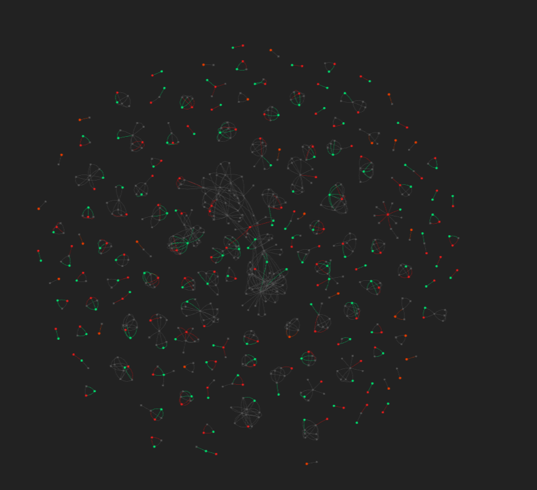
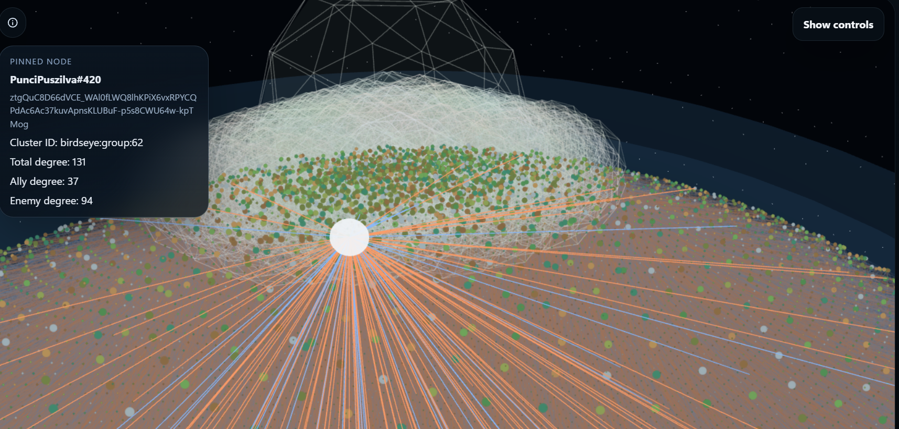
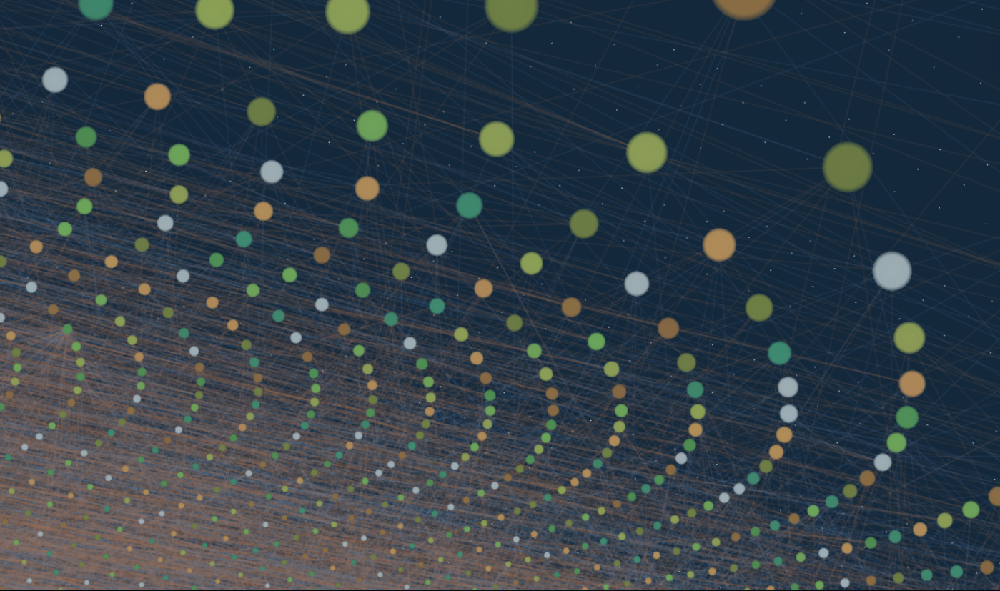

# Bird's-Eye 3D Sphere

## Document Role

This document explains the exported 3D global-view sphere as both a rendering system and a layout pipeline.

## Related Documents

- [New GUI Overview](new-gui-overview.md)
- [Route Transition Overlay](route-transition-overlay.md)
- [Signed Balance Theory And Implementation](signed-balance-theory.md)
- [Mock Datasets And Chaos Design](mock-datasets-and-chaos-design.md)
- [Unified Cluster Persistence And Exact A*](unified-cluster-persistence-and-astar.md)
- [Pathfinder Backend Prototype Notes](pathfinder-backend-prototype.md)

## Purpose

The bird's-eye sphere is the project's global-view interface for the full player network.

It is built from two major parts:

- Rust-side artifact export in `backend/pathfinder-rust/src/engine/birdseye.rs`
- frontend rendering in `frontend/src/GraphSpherePage.tsx` and `frontend/src/GraphSphereScene.tsx`

The key idea is simple: compute the heavy layout and graph artifacts ahead of time, then let the browser focus on rendering and interaction.

## In Plain Language

This document explains the big 3D graph view of the project.

If someone just wants the simple version: this is the "fly around the whole player network" page. The backend prepares the heavy graph data first, and the frontend turns it into an explorable 3D scene.

## Data Flow

The bird's-eye pipeline works like this:

1. load eligible players from SQLite
2. scan match JSON files and accumulate repeated pair relationships
3. derive graph metrics and signed edge properties
4. create cluster-like layout groups for positioning
5. export binary buffers and metadata
6. serve those artifacts through backend endpoints
7. render them in Three.js

The exported artifact set includes:

- `manifest.json`
- `node_meta.json`
- `node_positions.f32`
- `node_metrics.u32`
- `edge_pairs.u32`
- `edge_props.u32`

## Layout Logic

The Rust exporter builds positions in two layers.

### 1. Group anchors

Nodes are grouped using repeated-support adjacency, centered on the layout support threshold. These groups are then assigned anchor positions on a Fibonacci sphere.

### 2. Dense local placement

Members of each group are distributed around the anchor with a small tangent-plane spread so clusters stay visually dense instead of exploding outward.

The current implementation also tries to place cluster anchors with some awareness of cross-group match affinity, so clusters that share more real match history can end up closer than unrelated ones.

## Visual Layer

The Three.js scene adds a stronger spatial language on top of the raw graph points.

### Space framing

The sphere view now includes:

- a distant star field in the black background
- a lit gas-giant-like shell
- atmosphere and glow layers

This gives the graph a readable silhouette from far away and prevents the globe from vanishing into the background.

### Cluster legibility

The scene also generates faint 3D outline shells around denser clusters so they can be visually separated without turning the scene into a full force-directed fog.

### Edge behavior

Edges are always real graph relationships, but they are intentionally very faint at wide zoom levels. As the camera gets closer, edge opacity increases so the user can start reading actual match connectivity rather than only seeing a mass of points.

## Interaction Model

The sphere page supports:

- orbit, pan, and zoom navigation
- hover-based node preview
- click selection
- focus jumps from search results
- local edge highlighting for a selected node

The point-picking threshold is adjusted based on camera distance so node selection stays usable at different zoom levels.

## Why Precompute Instead Of Simulate

This was one of the most important engineering decisions in the whole feature.

Live force simulation in the browser would have looked tempting at first, but it would have created several problems:

- unstable layouts between runs
- poor reproducibility
- browser-side performance pressure
- hard-to-explain thesis screenshots and demos

Precomputing the layout in Rust gives the project:

- deterministic output
- exportable artifacts
- cleaner backend/frontend separation
- a stronger systems story

## Development Process Reasoning

The bird's-eye sphere changed direction several times before settling into its current form.

### 1. Raw point clouds were not enough

An early global view can easily become a cloud of anonymous dots. That is technically correct but visually weak. The globe shell, stars, and cluster outlines were added because the project needed a stronger visual frame for demos.

### 2. Cluster density mattered

If the layout spreads members too far from their anchor, clusters stop reading like communities and start reading like noise. The denser local spread was chosen to preserve a stronger "patch" identity on the sphere.

### 3. Background depth helps interpretation

The star field is not analytic data. It is scene framing. Its job is to create depth so the user reads the graph as an object in space rather than as disconnected marks on a black screen.

### 4. Close-up match structure needed to be recoverable

At far zoom levels, users need structure. At near zoom levels, they need detail. This is why edge visibility is distance-sensitive instead of constant.

### 5. Match-nearness matters more than arbitrary beauty

The latest layout work tries to keep cluster arrangement more faithful to actual cross-group interaction. The guiding principle is that a thesis graph should not only look good. It should also have a defensible relationship to the underlying data.

## Tradeoffs

The bird's-eye sphere still makes deliberate compromises:

- it is a projection for exploration, not a mathematically exact embedding
- the cluster shells are visual aids, not formal community boundaries
- edge visibility is tuned for readability rather than showing full density all the time
- cached exports improve runtime smoothness but create an extra artifact-generation step

## Future Direction

The next sensible improvements would be:

- better artifact regeneration workflow
- export versioning that is easier to inspect and invalidate
- optional filtering layers in the sphere UI
- stronger coupling between runtime graph mode and sphere-mode explanation

## Conclusions

The main conclusion is that deterministic export plus controlled visual dramatization gives the project a stronger thesis and demo story than browser-side force simulation would have.
