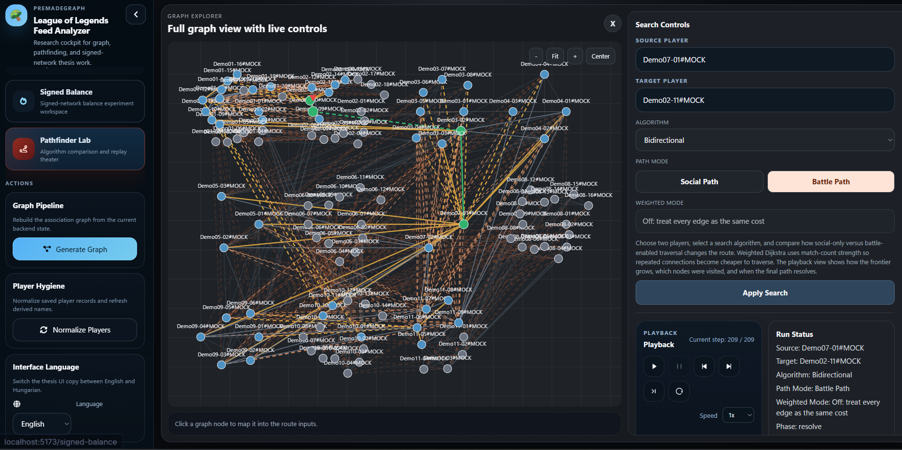

# Mock Datasets And Chaos Design

## Document Role

This document explains the synthetic datasets used for demos, controlled UI development, and smaller-scale analytic explanation.

## Related Documents

- [New GUI Overview](new-gui-overview.md)
- [Bird's-Eye 3D Sphere](birdseye-3d-sphere.md)
- [Signed Balance Theory And Implementation](signed-balance-theory.md)
- [Route Transition Overlay](route-transition-overlay.md)

## Purpose

The mock layer exists to support development, demos, and explanation when the full real dataset is either too heavy, too noisy, or simply unnecessary for a given UI flow.

The main implementation lives in:

- `frontend/src/pathfinderMocks.ts`
- `frontend/src/signedBalanceMock.ts`

## In Plain Language

This document explains the fake but carefully designed demo datasets used by the project.

The short version is: sometimes the real graph is too large or too messy for UI work and demos, so the project also keeps a smaller controlled graph that behaves in useful, explainable ways.

## Why The Project Uses Mocks At All

The mock dataset solves several practical problems:

- it gives the frontend a stable demo graph
- it makes pathfinding behavior easier to explain
- it allows signed-balance UI development without waiting on the full Rust backend
- it creates a smaller controlled environment for visual and interaction work

The key point is that the mock layer is not meant to replace the real graph. It is meant to be a compact, intentionally designed sandbox.

## How The Pathfinder Mock Graph Is Built

The pathfinder mock graph starts with predefined cluster sizes:

- `20, 18, 8, 4, 3, 12, 2, 16, 6, 14, 9`

For each cluster, the generator creates:

- a cluster id
- a rough center in a 2D layout grid
- multiple member nodes positioned around that center
- a few special roles such as bridge nodes and star nodes

This already gives the mock dataset a readable community structure before any matches are generated.

## Match Construction Strategy

The synthetic matches are then created in layers.

### 1. Base rivalries

Large groups are matched against each other in repeated 5v5 windows. This creates strong repeated ally ties within each side and strong enemy evidence across the rivalry boundary.

### 2. Small-cluster coalitions

Smaller clusters are combined into full teams. This prevents the dataset from becoming "only large clusters matter" and creates more interesting edge cases for routefinding.

### 3. Controlled chaos

This is the most important design choice.

Some matches intentionally place members of the same communities on both sides. That means the same pair histories can accumulate mixed ally and enemy evidence over time.

This is what the code comments call controlled chaos.

### 4. Mixed scrims

Later matches mix multiple clusters into both teams. This breaks clean block structure and creates more realistic overlap between communities.

## What The Chaos Factor Is Trying To Do

The chaos factor is not there to make the graph random. It is there to stop the mock graph from becoming trivial.

Without controlled chaos:

- pathfinding would be too obvious
- community boundaries would be too clean
- signed projection would become too sterile
- demos would look neat but unconvincing

With controlled chaos:

- some relationships become ambiguous
- some bridges matter more
- battle-path and social-path can behave differently
- the signed-balance page can show mixed local structures instead of a toy-perfect graph

In other words, the mock graph is intentionally messy enough to be educational, but not so messy that it stops being explainable.

## How Edges Are Derived

After synthetic matches are assembled, the mock system accumulates pair statistics:

- ally count
- enemy count

From that, each pair receives:

- a dominant relation
- a weight based on repeated evidence

This mirrors the real project at a smaller scale: repeated interactions are collapsed into a signed weighted edge.

## How The Mock Supports Pathfinder Development

The mock graph is especially useful for routefinding because it creates different kinds of scenarios:

- clearly connected friend-only paths
- friend-only dead ends
- cases where enemy-enabled battle paths unlock or shorten routes
- stronger and weaker ties for weighted traversal

This is why the file includes warnings and scenario notes such as:

- enemy edges create connectivity
- shorter with enemy edges
- no gain from enemy edges

Those are not cosmetic labels. They help explain what a given algorithm run is demonstrating.

## How The Mock Supports Signed-Balance Development

`signedBalanceMock.ts` reuses the pathfinder mock graph in `battle-path` mode and projects it into a signed graph for triad analysis.

That makes the mock useful for:

- testing triad counting UI
- validating chart rendering
- exercising threshold controls
- showing cluster-local imbalance summaries

Because the mock graph already contains controlled contradiction, it is a good fit for explaining why signed-balance results depend on projection choices.

## Development Process Reasoning

The mock layer was designed around a few practical lessons.

### 1. Perfect toy graphs are bad teachers

A fully clean synthetic graph might be easier to draw, but it does not teach much. Real player graphs contain bridge cases, ambiguous ties, and mixed evidence. The mock needed to preserve some of that complexity.

### 2. Random noise is not the same as useful complexity

Pure randomness would make the demo harder to reason about. The chosen approach creates *structured* mess:

- rivalry blocks
- coalition behavior
- mixed scrims
- repeated overlap

That gives the algorithms something interesting to process while keeping the story understandable.

### 3. The same mock should serve multiple surfaces

Instead of inventing one mock for pathfinding and a different one for signed-balance explanation, the project reuses the same base synthetic graph. That keeps the frontend easier to maintain and makes the demo feel more coherent.

### 4. Mock data should reflect product needs, not only test needs

This mock layer is not only for correctness checks. It is also a presentation tool. It helps the frontend stay demoable even when the real backend is unavailable or too heavy for fast iteration.

## Tradeoffs

The mock layer is useful, but it has limits:

- it is still hand-shaped, not emergent real-world data
- the cluster geometry is a demo layout, not a thesis claim
- chaos is curated, not naturally observed
- some behaviors are simpler than the real runtime graph

That is acceptable as long as the mock is clearly labeled as a teaching and development dataset.

## Recommended Future Direction

If the mock system grows further, it should stay disciplined:

- keep the synthetic scenarios explainable
- document every new chaos pattern
- avoid turning the mock into a second full graph engine
- preserve alignment between mock semantics and real-graph semantics

## Conclusions

The main conclusion is that the project's chaos factor is useful because it creates structured contradiction rather than arbitrary noise.
