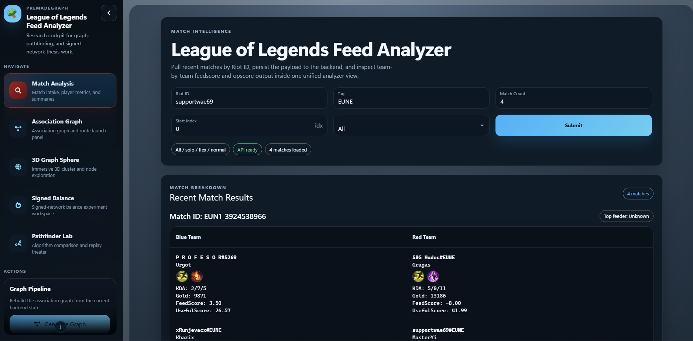
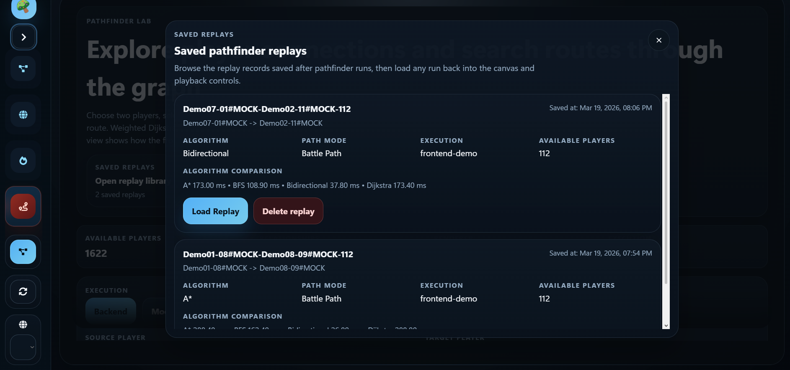
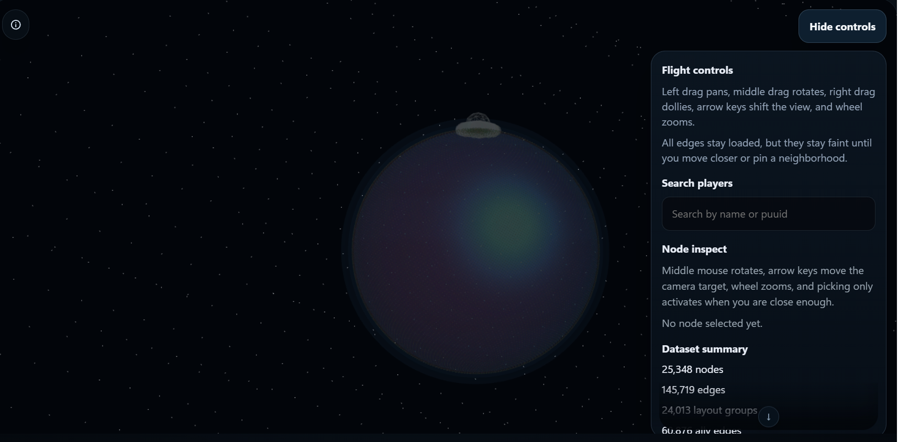
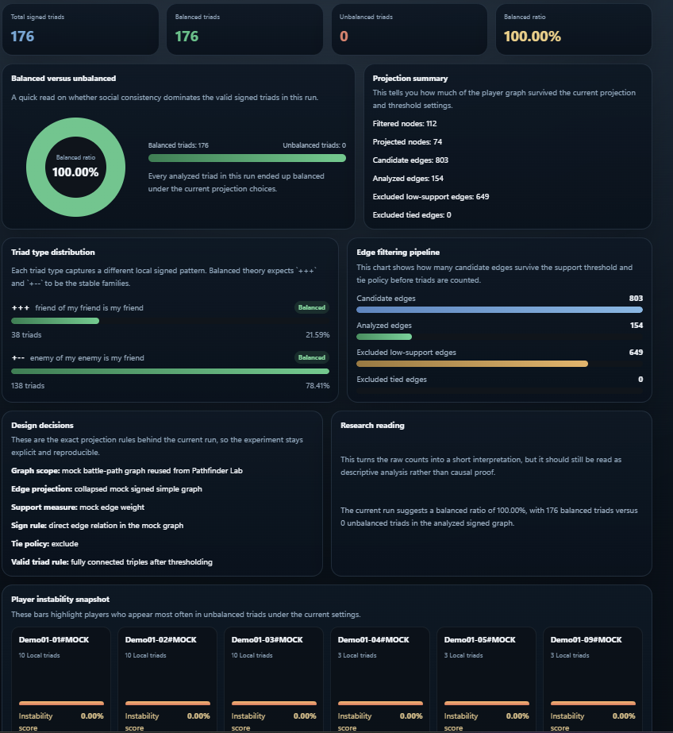

# New GUI Overview

## Document Role

This document is the UI-level entry point for the current frontend architecture.

## Related Documents

- [Route Transition Overlay](route-transition-overlay.md)
- [Bird's-Eye 3D Sphere](birdseye-3d-sphere.md)
- [Signed Balance Theory And Implementation](signed-balance-theory.md)
- [Mock Datasets And Chaos Design](mock-datasets-and-chaos-design.md)
- [Unified Cluster Persistence And Exact A*](unified-cluster-persistence-and-astar.md)

## Purpose

The current GUI is no longer a single-purpose graph page. It has evolved into a small frontend system with multiple focused surfaces:

- a match-analysis workflow
- a pathfinder laboratory
- a full 3D bird's-eye sphere
- a signed-balance analysis page

The main implementation lives in:

- `frontend/src/App.tsx`
- `frontend/src/AppNavbar.tsx`
- `frontend/src/GraphSpherePage.tsx`
- `frontend/src/PathfinderLabPage.tsx`
- `frontend/src/SignedBalancePage.tsx`

## What The New GUI Tries To Achieve

The frontend is designed around three simultaneous goals:

1. keep the thesis demo visually strong
2. keep graph analytics understandable
3. avoid putting heavy computation pressure on the browser

That means the GUI is intentionally split into views with different jobs instead of forcing everything into one screen.

## Main Surfaces

### Match Analysis

The match-analysis view remains the data-entry and raw-match exploration surface. It is useful for collecting, inspecting, and validating source data before higher-level graph interpretation.

### Pathfinder Lab

The pathfinder page is the algorithm-comparison surface. It focuses on route computation, playback, and algorithm behavior rather than on global graph aesthetics.

### Full 3D Graph Sphere

The graph sphere is the immersive overview surface. It is meant to make the entire network feel explorable at a glance while still supporting node inspection and search.

### Signed Balance

The signed-balance page is the research-style analysis surface. It presents structural-balance results with controls, charts, interpretation text, and optional cluster summaries.

## App Shell And Routing

The app shell in `frontend/src/App.tsx` does a few important things:

- lazily loads large pages
- keeps navigation persistent
- stages route transitions between pages
- separates the displayed route from the incoming route during animated swaps

This matters because the newer pages are heavier than the original UI. The split keeps initial loading lighter and reduces the feeling that the entire application is re-rendering on every navigation.

## Information Design Choices

Several interface decisions were made to reduce overload:

- large pages are split into cards and sections instead of long raw forms
- explanatory text is placed close to the relevant chart or control
- the 3D sphere info panel can be collapsed behind an info icon
- signed-balance controls use inline help and effect text so parameters are interpretable

The goal is not minimalism for its own sake. The goal is to keep a complicated graph project understandable during a live walkthrough.

## Development Process Reasoning

The GUI changes were guided by a few practical lessons from the earlier iterations.

### 1. One screen was trying to do too much

The older flow mixed data collection, graph generation, pathfinding, and explanation too tightly. That made the interface feel more like a toolbox than a product. Splitting the GUI into purpose-built surfaces made each page easier to explain and defend.

### 2. The browser should render, not simulate everything

For the bird's-eye view especially, it became clear that a precomputed layout would be more stable than pushing live force simulation into the browser. This is why the GUI now consumes exported artifacts instead of inventing positions on the fly.

### 3. Thesis demos need narrative structure

A thesis demo is easier to follow when the interface supports a sequence:

- collect or inspect data
- generate or load graph structure
- explore routes
- inspect global structure
- run a research-oriented analysis

The GUI now reflects that sequence much more clearly.

### 4. Explanations are part of the interface

The newer pages intentionally include contextual text, labels, and parameter notes because the project is not only about doing computation. It is also about making the computation defensible and legible to an evaluator.

## Tradeoffs

The current GUI makes a few deliberate tradeoffs:

- more custom UI means more frontend maintenance
- route transitions improve perceived polish but add orchestration complexity
- precomputed 3D layout improves stability but makes export freshness matter
- richer explanation panels take space that could otherwise be used for a denser dashboard

These tradeoffs were accepted because the project is thesis-facing and demo-facing, not only developer-facing.

## Recommended Future Direction

The next GUI steps should stay aligned with the same principles:

- keep analytics pages focused
- avoid UI-first feature work before backend validation
- prefer stable exported result schemas over ad hoc frontend transformations
- add visual depth only when it clarifies, not when it distracts

## Conclusions

The main conclusion is that the GUI now functions as a structured presentation layer for the whole project rather than as a loose collection of screens.
